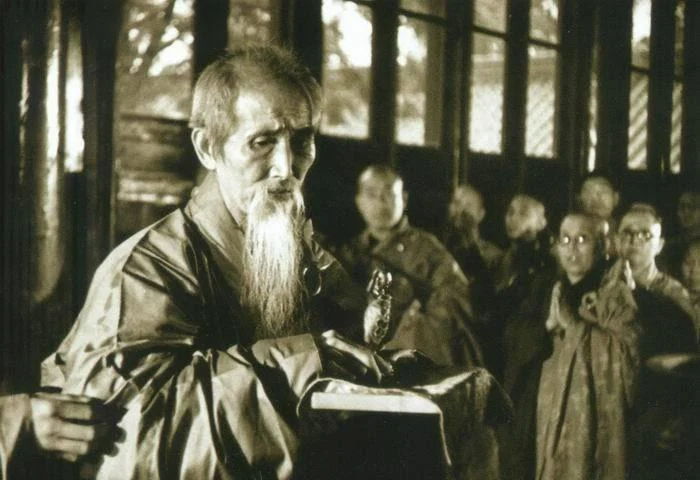

# Hua-t’ou

A Method of Zen Meditation1

*Hua-t’ou*, literally transalated ‘head word’ or ‘critical phrase’ is a practice used in Chinese Chan, Japanese Zen and Korean Seon. This practice is less well known than *koans*, which are longer, presented with a poetic introduction and an elaborate commentary. A *hua-t’ou* however is a stand alone, always short phrase that can be taken as a subject of meditation and introspection. The method was revived by the legendary modern Chan Master Xu Yun (1840-1959, pictured). As explained in this paper, it is particularly suited for household practitioners. The paper is taken from [the Open Buddhist University](https://buddhistuniversity.net/content/essays/hua-tou_lachs-stuart).

Author

Stuart Lachs

Published

February 1, 2012

[Download PDF File](../assets/hua-tou-lachs.pdf)

Unable to display PDF file. [Download](../assets/hua-tou-lachs.pdf) instead.
