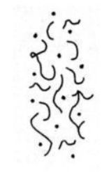
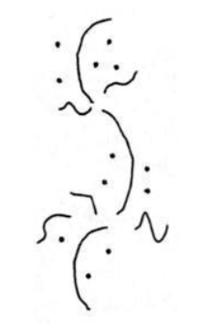
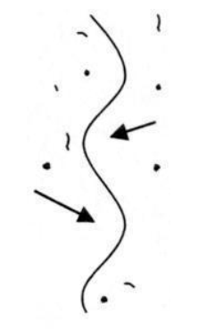
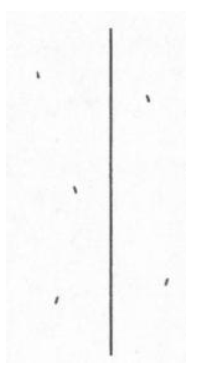
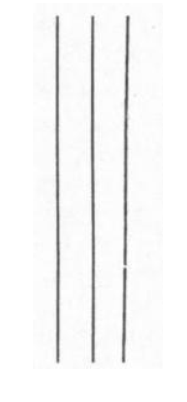

**What is samadhi anyway?**

(Linguistic pedantry follows. If you don't care about any of this, feel free to skip to the next section, although I think it's important and useful to be aware of the different ways in which seemingly 'standard' terms are used across different traditions, because it's so very confusing when these different usages get mixed up.)

The term [:samādhi](https://en.wikipedia.org/wiki/Samadhi) is used pretty commonly in the meditation and yoga world. However, like many popular meditation terms, different teachers and traditions use it in different ways, so it's worth taking some time to be clear about what it means in each context you encounter it.

According to Wikipedia (which is the source of most of my Sanskrit knowledge), it derives from the root sam-a-dha, which means 'to collect' or 'bring together'. It's thus often used as a synonym for 'concentration' or 'unification of mind'. Even there, though, it can mean different things.

Some traditions (such as Theravada Buddhism) make a strong distinction between 'concentration practice' (which is about stilling the mind and bringing about samatha/shamatha, 'calm abiding') and 'insight practice' (which is about investigating our experience and bringing about vipassana/vipashyana, 'clear seeing', which leads to the development of panna/prajna, 'insight/wisdom'). If the term is being used this way, samadhi usually means something like either the practice or result of stabilising the mind, or certain altered states of consciousness (e.g. the jhanas, 'meditative absorptions') which can arise as a result of such practice.

On the other hand, some traditions focus more on the 'bringing together'/'unification' meaning of samadhi, and thus regard samadhi as a movement towards or experience of oneness. Traditions which view the world as ultimately all a manifestation of one underlying 'divine essence' (for example) might thus regard experiences of 'oneness with the divine essence of the universe' as the whole point of practice.

Yet another use of samadhi is to mean something like 'deep, unshakeable realisation' - for example, the Samadhiraja Sutra (the 'King of Samadhi discourse') talks about 'samadhi' as the deep realisation of emptiness - something that would most commonly be regarded as the outcome of insight practice.

Zen tends to talk about samadhi quite a lot, and you'll find quite a bit of variety in what's meant. Usually, it's a broad term for a focused state - so Zen texts will often stress the importance of a type of 'samadhi' in everything you ever do, because a key feature of Zen is the idea that practice should reach every part of our lives, not be confined to something that you do for half an hour a day on a meditation cushion.

For the purposes of the rest of the article, we'll use 'samadhi' pretty synonymously with 'focus'.

**Why is it useful to develop samadhi?**

Looked at in its broadest terms, focus is a crucial life skill. It's hard to get anything done if you can't focus. The flip side of that is that any time and energy invested into developing your ability to focus has the potential to pay off in literally every part of your life. In very crude terms, you can think of focus as a kind of 'efficiency' - if you're trying to do something, but you're distracted 95% of the time, it's going to take 20 times as long to get it done than if you were 100% focused.

Focus is also very closely related to clarity, and this has important consequences for the depth of our practice. Normally, our minds are pretty noisy places - like a radio that is only very approximately tuned to a station, there's a lot of background noise, static and other signals interfering with what we're trying to listen to. This means we can easily become distracted by all the other stuff obscuring the signal, and even if we do our best to ignore that, we can't hear what's going on very clearly, because it's obscured by all the other stuff. In meditation terms, if our focus is poor, it's difficult to see what's going on in our experience, and even if we do notice something interesting which could lead to an insight, that insight might not touch us as deeply as it could if we had seen it more clearly.

So developing focus in meditation makes our practice both more efficient and more powerful. Sounds pretty good, right?

**How do we develop samadhi?**

In his marvellous book '[Hoofprint of the Ox](https://www.amazon.co.uk/Hoofprint-Ox-Principles-Buddhist-Chinese/dp/0195152484/)', Chan master Sheng-Yen describes the process of developing samadhi as a series of stages which can be represented visually. The Tibetan tradition also has a particularly rich set of teachings around developing samadhi which you can find described in tremendous detail in books like Culadasa's '[The Mind Illuminated](https://www.amazon.co.uk/Mind-Illuminated-Meditation-Integrating-Mindfulness/dp/1781808201/)' and B. Alan Wallace's '[The Attention Revolution](https://www.amazon.co.uk/Attention-Revolution-Unlocking-Focused-v-ution/dp/0861712765/)'. In what follows we'll use Sheng-Yen's pictures, with some extra detail from 'The Mind Illuminated'.

To develop samadhi, you'll need some kind of 'base practice' - some object to focus on. In 'Hoofprint of the Ox', Sheng-Yen describes using breath counting for this purpose. You can also use breath following, metta, a visual image, a candle flame, or basically anything that you can bring your attention to. But since we're using Sheng-Yen's images, we'll use his practice too in the description that follows (mainly because if we don't, one of his pictures doesn't make so much sense!).

**Stage 1: The scattered mind prior to meditation**

This image represents the typical mind state of the 'untrained worldling', to use the language of the early discourses. Our mind wanders freely, going here and there, at the mercy of torrents of jumbled thoughts and distractions. It's hard to see anything clearly.

Now, you might be reading this and thinking 'My mind isn't like that!' And maybe that's true - if so, good for you! But quite often people find that when they first start meditating, after a few days or weeks it seems like their minds are busier and more jumbled than before - as if the practice is making things worse. What's actually happening is that they're starting to develop some awareness of the state of their own mind, and so seeing all the activity that was there all along, but was previously *so* unclear that it couldn't be seen at all. So if you do start doing these practices and find that you're noticing a lot more going on in your mind than ever before - well done, the practice is working!

**Stage 2: Initial efforts to apply the method of meditation**

After you've been practising for a while, you'll start to develop longer periods of stability, where you can stay with the breath and the count for a while, before getting distracted. Unfortunately, at this point you won't notice the distraction right away; instead, you'll find that you 'wake up' some time later, and realise that you've been mind-wandering for a while, the breath and the count long-forgotten.

With more practice, you start to see how this process works.

- First, you're focusing on the breath.
- Then, you get distracted, and forget that you're meant to be focusing on the breath.
- If you don't catch it, your mind will start wandering freely, moving from thought to thought, until you eventually wake up.

A natural reaction to forgetting the breath and moving into mind-wandering is to feel frustrated or disappointed that you 'failed', but it's extremely important to realise that this is totally natural, and just another part of the process of developing samadhi. Everyone goes through this stage.

More than that, though, it's actually very helpful to try to train yourself to *celebrate* these moments of waking up from mind-wandering, as opposed to getting grumpy when you realise you've been lost. If you form the mental association between 'waking up' and feeling bad, you'll actually be less likely to wake up from mind-wandering, because who wants to make themselves feel bad all the time? Actually, though, this act of waking up is a moment of mindfulness - it's exactly the skill we're trying to train at this point in the process.

So it's really quite important to take the opportunity to give yourself a pat on the back when you catch yourself in a moment of mind-wandering. Well done - you spotted it! Smile, relax, take a moment to appreciate the fact that your practice is working, and then go back to counting the breath.

This might sound a bit cheesy, but it's genuinely important to form a positive association with waking up from mind-wandering - if it feels good, you're more likely to do it more often, and over time it'll happen sooner and sooner, until eventually you can catch it at the point of forgetting the breath, before the mind-wandering has even started. When you can do this, your samadhi has moved to a whole new level.

**Stage 3: Coarse but unbroken application of the method**

As the practice develops, sooner or later you'll get to the point where you don't lose the meditation object any more. This might sound almost magical if you're new to the practice and currently spending most of your meditation time lost in mind-wandering, but it does happen.

At this stage we become more sensitive to the process of getting distracted, and learn to 'steer around it'. We see that distraction follows a certain pattern, and as we become more sensitive we can nip this pattern in the bud before it goes too far:

- First, something (like an interesting thought) comes into our awareness, but our attention stays primarily on the breath. At this point it's a 'subtle distraction', to use the language of 'The Mind Illuminated'. So here, the breath is in the foreground, and the distraction is in the background.
- Next, the distraction comes to dominate our attention - the interesting thought comes into the foreground, and the breath goes into the background. (People often describe finding that they can continue to count their breaths in the background whilst having a conversation with themselves in the foreground - this will almost certainly happen to you at some stage, if it hasn't already.) This is now a 'gross distraction', and we're one step closer to losing the breath.
- Finally, the distraction becomes so captivating that the breath falls out of attention entirely. At this point, we have forgotten the breath, and if we don't catch ourselves soon, we'll be going down the mind-wandering path for the millionth time.

As the practice develops, you'll become more sensitive to the presence of distractions. You'll develop a kind of 'introspective peripheral awareness' - in the same way that you can see things out of the corner of your eye even when looking deliberately at something in the centre of your vision, you'll become aware of the level of 'background noise' in the mind whilst staying focused on counting the breaths. When the background noise level goes up, and there's an increased risk of getting distracted, we can apply a little more energy and diligence toward staying with the object, so that we don't get drawn off course. Also, as we become more aware of subtle distractions threatening to impinge on our samadhi, we can deliberately let go of those subtle distractions, rather than allowing them to creep up on us and become gross distractions.

**Stage 4: Subtle and unbroken application of the method**

Sooner or later, our mind starts to get the message - we're choosing to stay on the breath, and that's all we're interested in right now. The distractions start to fall away because they aren't getting any love. (There's a saying in Zen, that where attention goes, energy flows - so by deliberately withdrawing your attention from the distractions, you aren't feeding them any energy. Sooner or later, they'll wither away.)

If you've looked into jhana practice at all, you might have come across the term 'access concentration'. This is defined in different ways by different teachers, but typically it means something like a state where the attention stays consistently with the object, and any distractions that do come up are 'wispy and in the background'. At this point, there are no gross distractions any more - the only distractions that do come up remain subtle, and the strength of your concentration is enough that you don't really need to do anything to 'steer around' them as you did in the previous stage.

**Stage 5: Pure but effortful concentration on the method**

Now the practice is really maturing. Distractions, even subtle ones, have completely gone. All that remains is three things: the breath, the count, and the intention to keep the practice going.

That third point is worth elaborating a bit. At this stage in practice, there's still a sense that effort is required - that this is a deliberate practice, and if you took your eye off the ball the distractions would come back. Another way of saying this is that there's a sense of 'doing' - a sense of a 'meditator' who is keeping the practice going. (You might think 'well of course there's a meditator - it's me! But hang in there - we have two more stages to go yet...)

Over time, the practice matures still further, until effort is no longer required. This is a subtle stage of practice, and it's easy to take your foot off the pedal too soon and fall back into distraction; but on the other hand it's important to realise that samadhi ultimately becomes effortless, because otherwise you can keep propping up the sense of effort longer than you need to.

**Stage 6: The unified mind of samadhi**

Finally, the practice becomes effortless. When there's no 'doing', there's no 'doer' - there's simply 'this'. The mind has become unified.

Sheng-Yen describes this stage thus:

> As the mind becomes truly calm and concentrated, the act of effortful meditation itself seems coarse and distracting. Letting go of it, number and breath vanish, and body, breath, and mind meld into a single unity. At this point, you may feel as though spatial distinctions no longer pertain among body, mind, and the world. The opposition between self and other people seems to vanish, and the boundary between the internal and external dissolves. The previous sense of dividedness is replaced by a feeling of pure and harmonious being that is so wondrous as to be indescribable.
>
> *-Master Sheng-yen. Hoofprint of the Ox: Principles of the Chan Buddhist Path as Taught by a Modern Chinese Master (Kindle Locations 894-897). Kindle Edition.*

At this point, we have accomplished what is sometimes assumed to be the goal of spiritual practice. As my Zen teacher likes to say, when you become one with anything, you become one with everything. This is a state of great peace and joy, and makes all the effort to get to this point seem well worth it.

But wait, we're not done yet!

**Stage 7: No self, no mind**

(No, the image hasn't failed to load - the final picture is blank.)

In Zen, becoming one with everything is merely a step along the path, not the final destination. We have further to go. I'll let Sheng-Yen describe this stage too:

> In the seventh diagram there is no line of concentration, no thought, no mark of any kind. Body, mind, and environment have all genuinely disappeared. Time and space are blown apart, and any sense of existence or nonexistence has vanished. You have entered a realm of emptiness and quiescence, a realm that transcends all subjective emotion and point of view. This is the experience of supramudane samadhi and wisdom of 'no-mind' that is free of the defiling illusion of self. There is no way to effectively describe it. All words and images are useless; but you will have tasted true freedom and peace.
>
> *-Master Sheng-yen. Hoofprint of the Ox: Principles of the Chan Buddhist Path as Taught by a Modern Chinese Master (Kindle Locations 905-909). Kindle Edition.*

**Practising samadhi when you live in the world**

These latter stages in particular sound pretty exalted, and you might be wondering if there's any point even trying this, or if you really need to be a cave-dwelling hermit to have a chance of getting any benefit from this practice.

It's a fair question. It takes a lot of work to get to the later stages in this model (Culadasa suggests meditating for two hours a day for a couple of years to reach the final stage in his model), and that's going out to be out of reach for most people unless they're really keen on this practice and willing to organise their lives around it, at least to some extent. (There are even deeper states of samadhi that really do require monastic levels of commitment to have even a chance of achieving them - look up the Venerable Pa Auk Sayadaw's teachings for an example.)

However, this practice begins delivering benefits from your very first sit. As I said right at the beginning of this article, we need focus to do basically anything in our lives, and any movement we make in the direction of being able to focus better, no matter how small, pays dividends in every aspect of life. Simply becoming more aware of what's actually going on in our minds - seeing that torrent of thought and distraction - is a game-changer for many people. Learning to reduce the time we spend lost in mind-wandering is huge, and training ourselves to appreciate and enjoy those moments of coming back from distraction can change our whole relationship to meditation, turning it from being a chore into being a source of joy. All of these things are incredibly valuable, and don't require you to practise all day long in a Himalayan cave.

My teacher's teacher on the Theravada side, the late Venerable Ayya Khema, liked to say that 'a moment of samadhi is a moment of purification'. Each moment we spend focused on our meditation object is a moment that we aren't lost in thought; it's a moment where we choose to set aside the promptings of the inner forces of greed, hatred and confusion that drive so much of our behaviour; it's a moment where we choose not to feed the habitual patterns of mind that run our lives, and instead bring us into a more direct relationship with the present moment. It's a way of taking ownership of ourselves and our situations, making our own choices rather than allowing them to be made for us. It's a way of being more fully here, more fully human, more fully awake to our lives, and that's the true gift of all spiritual practice.
