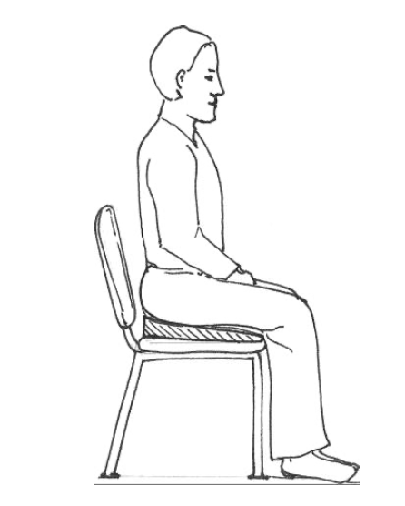
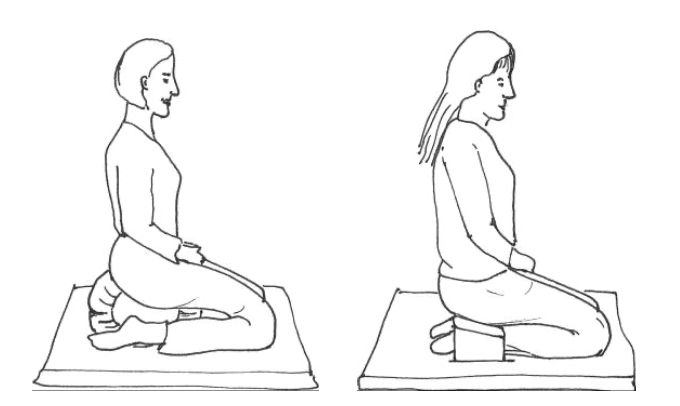
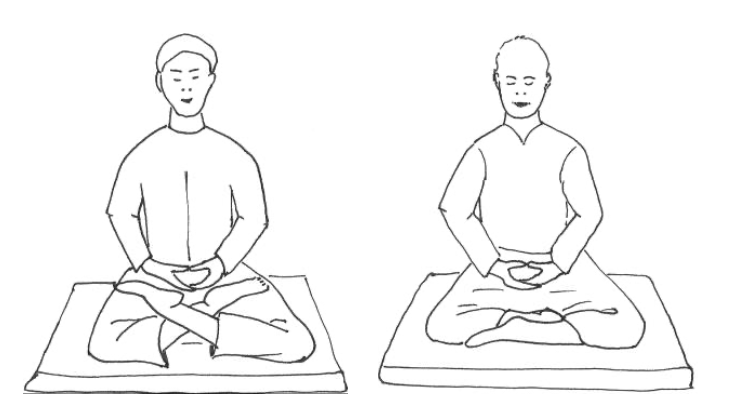
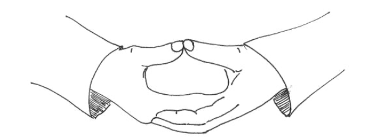



```{=typst}
#align(center)[_"Can you teach me how to meditate," you ask._]
```
---

<br><br><br><br><br>

```{=typst}
#outline(
    title: [],
    depth: 1
)
```

---



```{=typst}
#set page(numbering: "1", number-align: right)
```



# How to meditate?

## What is meditation?^[These instructions are taken from [_Introduction to Meditation_](https://westernchanfellowship.org/dharma/library/article/introduction-to-meditation/) by Simon Childs from the Western Chan Fellowship. It follows the Chan tradition of Master Sheng-Yen. ]
We are used to the concepts of training the body in a skill or for fitness or dexterity, and of training the mind in factual knowledge or in a mental skill such as arithmetic. Meditation is many things but it is none of these. Meditation is a training of the mind to be calmer, clearer, more attentive and concentrated. Meditation is also a tool for investigation into the phenomenon of mind, making use of calm clear awareness to directly experience the basis of mind which ordinarily is obscured by busy thoughts and memories. Though primarily a mental practice meditation is inseparable from bodily experience which provides a focus for stabilising and awakening the mind, and which is the source of the sensory experiences from which we create our mental world.

Meditation is an ancient practice known to humanity for thousands of years, coming down to us in many forms through various traditions. Buddhists have practised these methods extensively, classifying and refining them, understanding the differences between them and how best to apply them.

For most beginners to meditation the important first step is to learn how to calm and concentrate the mind. There are specific meditation methods to assist with this. Most of us juggle many responsibilities and concerns and have busy distracted minds. Even when we are in-between activities our mind is never at rest – we are ruminating on what has happened in the past, or speculating on what may happen in the future.

Once we have made some progress in calming the mind we may be able to take up the other principal aspect of meditation, using methods which cultivate awareness and which give us insight into the basis of mind. We discover where our thoughts come from, how they proliferate, and how they may take us in the wrong direction. Such insight enables us to free ourselves from long-established but often unhelpful habits of thought and action.

## Body

Meditation is usually done in some variant of a seated posture and for this reason meditation is often referred to as ‘sitting’. There are several postures which may be suitable. The key is to identify a posture in which you can remain balanced, stable, and relaxed, so that your mind is not disturbed by an uncomfortable body.



Sitting on a chair, preferably an upright dining-style chair, can work well. Use a wedged cushion or sit on the front edge of a meditation cushion placed on the seat, without leaning on the chair back. Leaning back on a more comfortable chair may also work but it is more likely that you will slip into drowsiness instead of meditation.

A ‘kneeling chair’ may also be used. There are various designs of these marketed to people suffering from back pain, and they may also be suitable for meditation.



A kneeling position with the body weight supported on a cushion or kneeling bench works well for many.



In the East, use of cross-legged postures such as lotus posture is traditional but these are often difficult for Westerners who have not been brought up sitting cross-legged on the floor.

If you wish to sit this way use a firm meditation cushion and sit on the front edge of it. The traditional Lotus posture is often unsuitable for beginners unless you have trained in yoga and are able to take this position comfortably and without strain. Other cross-legged postures may be considered but don’t use them if they are too uncomfortable or unstable and therefore distracting. Ordinary cross-legged sitting with the knees up in the air is not suitable as it is unstable and soon becomes uncomfortable.

## Relaxation

If you begin a meditation session with tension in the body it may become uncomfortable, even painful, triggering you to shuffle position repeatedly and causing disturbance in the mind that you are trying to settle. With a well-balanced posture you will be able to sit still with little need for muscular effort to support the body.

Once settled into your chosen sitting position check that the body is relaxed. Mentally scan the whole body checking each part and relaxing it whenever you find some tension.

Start with the face. Check that the eyelids are relaxed with the eyes a little open and the gaze looking half-down towards the ground, about 45 degrees from horizontal but not focused on anything in particular. Check that you are not holding a frown or a grimace or any other tense facial expression, and if you are then relax this. If your head is well-positioned and balanced on the neck then the neck muscles can rest. If your head is tilted too far forwards or backwards, or tilted or turned to the side, then there will be tension in the neck muscles. Centre and balance the head, and relax the neck.

If your shoulders are tense or hunched let them drop and relax. Arms also should be relaxed. The traditional position for the hands is to have the palms facing upwards, one on top of the other, with the tips of the two thumbs lightly touching.



To avoid tension ensure there is support for the hands and that they do not require any effort to be held in position. You may rest them in your lap but it is often better to place a small cushion or towel on your lap to make a platform on
which to rest the hands. In this way there is no effort needed to support them and the hands, arms and shoulders can all
relax.

Your back should not be slumping forward but don’t over straighten it either. Keep it upright with the natural curvature, not leaning to either side, not twisted, and not leaning forward or backwards. As you begin a meditation session you may sway a little left and right, forwards and back, to find the most balanced and relaxed position.

The breath should be natural, and the abdomen relaxed.

There will inevitably be some pressure on your legs and buttocks as they bear the weight of the body, and perhaps some tension in the joints as they are folded into the posture. Ensure that you are not adding unnecessary extra tension by ‘fighting’ against the posture. Just relax into it, accepting the pressure and sensations.

If you become aware of tension developing during the meditation period see if you can relax it away. If not, just allow it to be there as part of the experience of sitting so long as it is not a significant distraction.

## Mind

Once the body is seated, relaxed in a stable position in a suitable environment, what should you do with your mind?^[The word 'mind' is used a lot in Eastern wisdom tradtions. It is good to bear in mind - no pun intended - that in Western cultures mind is primarily associated with thinking, ratio and the like. In Eastern philosophy, mind is associated with a unified 'heart-mind', as exemplified by the Chinese  character _xin_ (心, 'heart'). The heart-mind encompasses emotion and reason. Actions, feelings, and beliefs are deeply integrated rather than separated. This is quite different from the common Western perspective of the mind-body duality.] You will quickly discover that given nothing to do except sit there the mind fills the space with memories and fantasies, anxieties and desires, or it simply dozes off. Your task at this point is to keep the mind awake and present but relatively inactive. It can be surprisingly difficult to achieve this and this is where the application of a meditation technique or 'method’ is very helpful.

It is often helpful to pick an ‘object’ to focus on and to return the attention to that object whenever the mind dozes or wanders off on a train of thought. This trains the mind in focus and concentration.

There are several possible objects - the usual recommendation for beginners is to focus on awareness of
the sensations of your own breathing.

### Following the Breath
As you sit there are gentle sensations of breathing at different places in the body and your first task is to locate and experience these sensations. For some the most obvious sensation is of the air entering and leaving the nostrils, perhaps feeling cooler as it enters and warmer as it leaves. Others find that it is the gentle in and out movement of the abdomen that is most prominent. Surprisingly there is not usually much sensation of chest movement because in a relaxed resting state the breath is fairly shallow and gentle, coming mainly from the diaphragm with very little movement of the chest.

Select what you find to be the most prominent sensation of breathing, for example at the nostrils or the abdomen, and make this your object of meditation. Set yourself the task of being continuously aware of this part of the body and its sensations. When your mind wanders away thinking about something else, or the awareness becomes dull, bring it back in contact with the sensation of breathing. The attention will often wander away from the breath. This can be rather frustrating but is quite usual. Each time you realise that you have lost awareness of the breath just gently bring awareness back to the sensation of breathing without any fuss or self-recrimination.

### Counting the Breath
If the mind is not yet trained to concentrate then remaining attentive to the sensations of the breath can be difficult and you may find that you are distracted much of the time. It can be helpful to strengthen the method by adding in counting of the breaths. The additional task of not only experiencing the breath sensations but also counting the breaths leaves less opportunity for the mind to wander. There are various styles of counting, the basic being to count the exhalations silently. As you breathe out, count ‘one’ to yourself. On the next exhalation count ‘two’, and so on.

Typically within a few breaths the attention will wander. When you realise that it has wandered then start again at one on the next exhalation. If your attention is fairly stable and you manage to reach a count of ten breaths without wandering, start the count again at one and repeat the cycle.

### Natural Breath
It is important when focusing on the breath sensation that you allow the breath to move naturally. Breathe through the nose with the mouth closed. Do not alter the breath to be deeper or shallower, slower or faster - just experience the sensations of natural breathing. If the natural regulation of the breath is overruled this can lead to dizziness or chest tightness. Some people find that when they observe the breath it is difficult for them to avoid changing it, and for such people the methods of following or counting the breath may not be suitable. They can use an alternative object of focus for their meditation.

### Other Methods
Common alternative objects include: a silent recitation or mantra; the gaze resting on an external object such as a flower, a candle, an image or statue; a continuous or frequent sound such as flowing water, or it could be the background hum of traffic or city noise. The main criterion for choosing an object of meditation is that it should be something stable and simple such that it does not stimulate the mind into thinking.

Another good option is to place the awareness on the overall experience and sensation of the body as it is sitting. This may include awareness of breath as a part of the experience but breath is no longer the prime focus. Body awareness includes the sensation of the pressure points of sitting i.e. the buttocks and knees, the balance of the spine and neck, and relaxation of abdomen, arms and shoulders. It may also sense the light touch of clothing, or draught, or sunlight on the cheek. This awareness also includes any emotional feelings that arise and are sensed in the body.

All these are experienced, but none are elaborated by internal conversations which might draw the attention away from the next moment of body awareness. In this way one is very present in the experience of sitting, but is doing nothing else, and this practice is known as ‘just sitting’. Th is method can be harder to establish and sustain than more narrowly focused methods because the wider awareness notices multiple sensations and feelings which may trigger trains of thought. But if you are able to sustain this wider awareness then you are in a good position to take up the other principal aspect of meditation, to investigate the mind.

### Developing the meditation, investigating the mind
The methods described above are primarily methods for calming the mind, generating concentration and focus. These are valuable in themselves but can also be regarded just as preparation for taking the meditation practice another step, into the investigation of mind.

Once the mind has calmed down we begin to find ourselves in a state where the thoughts are no longer tumbling over each other creating noise and confusion in the mind. We may be able to observe each thought as an individual process which has a beginning, a middle, and an end, which was previously unobserved as each thought was interrupted or overshadowed by other thoughts. We may even experience a mind with no thoughts, a mind resting between thoughts.

With a mind in this calmed condition we have the possibility of investigating the nature of mind and thoughts directly in our own experience. What is mind and where do thoughts come from? We can switch our object of concentration from some arbitrary choice, such as breath or candle, to the mind itself, observing our mind while thoughts and feelings and sensations arise in it and pass through it. With our improved concentration we maintain attention on the mind, noticing when we are drawn away by something which arises within our awareness. We practise focusing on the mind itself and are less involved with its contents.

This requires a stable wider open awareness which can experience phenomena without becoming engrossed in them such that other phenomena are overlooked. Cultivate this by practising it through regular formal sitting meditation, and also by continuing this wider awareness when going about one’s everyday life.

### Difficulties
Meditation is not always easy. There are the practical difficulties which can be very real of finding undisturbed time and place for sitting meditation. There can be difficulty finding an appropriate posture which supports you well enough for a period of meditation without becoming too uncomfortable. The mind can be hard to train and calm down, and is also prone to being drowsy and switching off. Developing the practice towards an open awareness can be tricky because the mind remains so easily caught by and lost in trains of thought.

It is often said that meditation cannot be learned from a book so why have I written the instructions above? These are to be taken only as an overview and as pointers for beginning, and not as a whole description of how to practice meditation. There are tips and strategies for dealing with the difficulties that arise and they are best taught in person and individually, adjusted to your particular circumstances. For further development of your practice it is best if you consult a meditation instructor, or a meditation master, rather than relying too much on written materials. Bodhidharma, the founder of the Chan Buddhist tradition in 5th century China
said,

> _“It’s true, you have the Buddha nature. But without the help of a teacher you’ll never know it. Only one person in a million becomes enlightened without a teacher’s help.”_

### Deepening the Practice
Unfortunately it is rare to click immediately with meditation. Initially it can even seem to be going ‘backwards’ as you become more aware of just how busy and chaotic your mind can be and yet do not immediately get any sense of calming. But persistence is the key and this takes several forms.

In general it is best to stick at it even if it doesn’t seem to be going well as it is sometimes necessary to push oneself through a difficult patch. This applies both to a single meditation period and also to a pattern of ongoing practice. But don’t make it into an unwelcome chore which may lead you to disengage from the practice. This requires judgement and is an example of a situation where contact with a teacher may be helpful for advice on how to proceed.

Rather than meditating rarely or irregularly make it a regular part of your life, preferably daily. The amount of time that you can give to it will depend on your lifestyle and commitments but most people can manage 10-15 minutes a day, perhaps 30-40 minutes, and a small amount of regular meditation is better than infrequent longer periods.

Do occasional extended sessions such as one-day retreats or longer residential silent retreats in which you will sit multiple meditation periods. It is usually most practical to join some organised event where someone else is taking care of practicalities such as timetabling and food, and exercising between sitting periods, so that your meditation is not disturbed by concerns about these. These longer sessions of repeated meditation periods have a ‘cumulative’ benefit. The calming effect of one sitting period may not seem very great, but you may enter the next period in a better condition and the next in an even better condition. Over a longer session like this without distractions between the periods you may reach a depth that is not usually encountered on everyday single sittings.

Allow the practice to flow from the formal sittings into the rest of your life. There is no need to cut off awareness or busy the mind just because you have reached the end of your designated meditation period! Continue into your life with awareness and stability, and observe (instead of being caught by) your tendency to reactivity when encountering people and situations. This is the cultivation of mindfulness in daily life and is a crucial step in developing your practice.



# Why meditate?

You say you want to meditate. Why is that? To calm your mind? To become a better person? To become enlightened? I find that this question is actually part of the creative tension that I continue to work with in my daily practice:

> There is a fundamental tension in many Buddhist meditation practices, bequathed to their modern iterations, between the _constructive_ aspects of meditation---the cultivation of attitudes, virtues, ideas, emotions, ways of thinking and being---and the _deconstructive_---the dismantling of all of these.^[David McMahan, _Rethinking Meditation_ (2023).]

Three basic components are included in what David McMahan calls the Standard Version of meditation, namely: i) an emphasis on meditation as a individual, private experience; ii) a claim that meditation allows us to gain direct access to the way reality ‘really’ is, to the ‘Truth’; and iii) that meditation is a kind of scientific technique for observing the mind. Meditation enable individuals to gain a non-biased understanding of themselves and the world.

But there is no 'right' or 'wrong' way to meditate, just as there is no standard version of meditation. The whole point of meditation---or personal practice---is to continously keep questioning life, the universe and chocolate cookies. Over time, I have found that getting to a point of not knowing, of letting go is an essential part of meditation. It is about working with paradoxes and contradictions that seems unsolvable. It is an embodied practice, as my Dutch meditation teacher often said:

>_Er is niets dan de ervaring._^[Sebo Ebbens, founder of Nalandabodhi Nederland.]

It is about engering openness, freshness of ordinary mind. Picasso's famous quote:

>_“It took me four years to paint like Raphael, but a lifetime to paint like a child.”_

to me points to the same direction as Shunryu Suzuki's:

>_“In the beginner’s mind there are many possibilities, but in the expert’s there are few.”_


## The ethics of meditation

The constructive aspects of meditation essentially aim for leading a 'good' life---whatever that may be. Traditionally, we start a meditation practice with reciting an aspiration or a Buddhist vow. In the Chan tradition, we say this at the beginning:^[Master Sheng-Yen, _Illuminating Silence_.]

>| _I vow to deliver innumerable sentient beings._
>| _I vow to cut off endless vexations._
>| _I vow to master limitless approaches to Dharma._
>| _I vow to attain supreme buddhahood._

The aspiration of Gampopa in the Kagyu tradition has a similar intent:^[Gampopa, _Ornament of Precious Liberation_.]

>| _Grant your blessing^[_jin gyi lab_ in Tibetan is usually translated as 'blessing', which may be misleading some. The Tibetan term literally means to transform, to uplift, to brighten. 'Grant your inspiration' may have a better connotation to Western ears. See [common misunderstandings about tantra](https://studybuddhism.com/en/tibetan-buddhism/tantra/buddhist-tantra/common-misunderstandings-about-tantra).] so that the mind of myself and all beings may be one with the dharma._
>| _Grant your blessing so that the dharma may progress along the path._
>| _Grant your blessing so that the path may clarify confusion._
>| _Grant your blessing so that confusion may dawn as wisdom._

In a more secular context, David McMahan offers a more critical perspective on meditation.^[_ibid.]


four different perspectives on the ethis of meditation:

- the ethic of appreciation
- the ethic of authenticity
- the ethic of autonomy
- the ethic of interdependence


But be aware, while having aspirations and inspirations is useful in sustaining a practice, don't strive or hope for anything.

> _You came to this retreat in hopes of improving your practice and clearing your minds through meditation. If you had greater expectations, perhaps I discouraged you when I said that meditating has nothing to do with becoming enlightened. One of you wondered what the point of meditating is, if it does not lead to enlightenment. The answer is that while meditation does not lead to enlightenment, if you do not meditate you will never be enlightened._^[Master Shen-Yen, [commentary on Nitou's _Song of Mind_](https://www.lionsroar.com/sought-for-it-is-not-seen/).]



# What makes you not a Buddhist?

> When the Buddha taught the Four Noble Truths he repeated them three
times, expanding them successively. First he said, “There is suffering in this
world. There are causes of this suffering. There is cessation of suffering, and
there are ways to reach the cessation of suffering.” Then he said, “There is suf-
fering in this world, one has to understand it. There are causes of this suffer-
ing, and one has to eliminate them. There is cessation of suffering, and one
has to attain it. There are ways to reach the cessation of suffering, and one
has to work upon them.” The third time he said, “There is suffering in this
world, one has to understand it, but actually there is nothing to understand.
There are causes of this suffering, and one has to eliminate them, but actu-
ally there is nothing to eliminate. There is cessation of suffering, and one has
to attain it, but actually there is nothing to attain. There are ways to reach the
cessation of suffering, and one has to work upon them, but actually there is
nothing to work upon.” This was the first teaching of the Buddha, which he
gave at Sarnath to his first five disciples: Kaundinya, Bhaddiya, Vappa,
Mahanama, and Asvajit.^[Ringu Tulku, _Daring Steps Toward Fearlessness: the Three Vehicles of Buddhism_ (p. 22).]



# What is consciousness?

I had taken my exploration of consciousness^[The following is taken from _A World Appears_ by Michael Pollan. It is the last chapter in the book, a coda, entitled _The Cave_.] about as far as this mind could take it. Here at the end of the journey, I needed to come to terms with the fact that the kind of ultimate answers I had hoped to find might not be findable. Yet all along the way, I’d been trailed by a quiet voice that every so often would whisper to me: Maybe you’re using the wrong kind of mind.

Did that mean I’d leaned too hard on spotlight or professor consciousness? Possibly. I was definitely inclined to that kind of narrowing of focus, turning the spotlight of intellect on what I regarded as a scientific or philosophical puzzle to be solved. Hoping to heed the quiet voice, I’d explored a variety of more experiential or descriptive approaches: phenomenology, literature, psychedelics, hypnotism, and meditation—all ways of exploring consciousness that don’t necessarily treat it as “a problem.” But there was one last path I needed to go down, one that didn’t even promise answers and actually made a virtue of not-knowing.

Joan Halifax is someone I’ve admired since reading a profile of her in The New Yorker in 2015. The writer Rebecca Solnit had tagged along on the annual trek that Halifax leads through the mountains of Nepal, bringing a cadre of doctors and dentists to remote mountain villages with no access to health care. Each summer over the course of two weeks, the Nomads Clinic covers more than one hundred miles on foot and horseback, at altitudes of up to twenty thousand feet. The “medical mountaineers,” all volunteers, sleep in tents, often in freezing temperatures. One quote from the profile of Halifax’s life stuck with me: “I just lived as though my hair were on fire.” After some forty annual trips to Nepal, Halifax recently decided it was time to hang it up. She had just turned eighty.

Anyone who thinks Buddhism and the contemplative life amount to a form of quietism or a retreat from the world’s suffering should spend some time shadowing Joan Halifax. Follow her when she’s ministering to the dying in hospice, or working with the homeless in Santa Fe, or caring for prisoners on death row, or leading a protest for peace, or bringing medical care to remote mountain villages half a world away. I don’t know if Halifax has shed the last remnants of her ego—she would say she hasn’t—but the selflessness she manifests in the conduct of her life is something to behold, a reminder that there is not only a science but also an ethics to being a conscious human. This, too, is a Buddhist principle—that overcoming one’s own small self should lead to greater compassion for others, and that the suffering alleviated when we transcend the ego is not only our own.

For more than thirty years, Halifax has been the abbot at Upaya Zen Center, the retreat she founded in Santa Fe in 1990. I’ve had the chance to meet Halifax a couple of times; once, we appeared together on a panel to talk about psychedelics. Halifax was married to the pioneering Czech psychiatrist Stanislav Grof for several years in the 1970s. Working together, they administered transformative doses of LSD to the dying. For a period of time, Halifax frequently took large doses of LSD herself. Her first psychedelic trip, while wandering the streets of Paris in 1968, showed her “that there was beauty behind the beauty I perceived, and that mind was both in here and out there. I was dumbstruck.”

I emailed Halifax to see if I might pay a visit to Upaya. My idea was to spend a week or so in residence, meditating with the aspiring monks, performing monkish chores, interviewing Halifax, and seeing if I could make a little more progress untying the knot of self. “Upaya is a factory for the deconstruction of selves,” she told me. I was curious to find out how that worked.

But Roshi Joan, as everyone calls her, had other plans for me. She decided I should spend a day or two at Upaya and then accompany her up to “the refuge,” an off-the-grid compound of tiny houses and huts stretched out across a broad hammock of meadow at ninety-four hundred feet in the Sangre de Cristo Mountains north of Santa Fe. Whenever she’s not traveling or running conferences or teaching, Halifax retreats to these mountains, where she meditates and hikes and paints and writes and doesn’t have to play the role of abbot. She dispatches students to the refuge when she deems them in need of a period of monastic solitude—for years at a time, in some cases.

“After you’ve acclimated to the altitude, we’ll drive up to the refuge,” she said by email before my arrival in Santa Fe. “You can stay in the cave.” This was not put in the form of a question.

_The cave?_

Halifax explained that even though it did not have plumbing, electricity, or an internet connection, this was “a five-star cave” and I would be comfortable—or, more likely, I’d be uncomfortable in a spiritually productive way. I’m not much of a camper but decided I might as well put myself in her hands to see what the experience would yield.

The first thing you notice about Joan Halifax is her undiminished beauty—the shining blue eyes and the easy smile and the generous sweep of white hair, still metaphorically on fire. That she’s in her eighties is hard to believe. She moves through Upaya’s little village of low-slung adobes and tended gardens with a graceful authority. Yet abbot is a role that, these days, she’s more than happy to trade for the solitude and freedom of the refuge.

The refuge is at the end of a twenty-five-mile-long rutted dirt road that climbs through a shadowy forest of pine and spruce, punctuated by the sparkle of the occasional stream or meadow. Though it was well into June, spring was still unfolding at this altitude, the meadow grasses and spruce tips still bright green and the groves of ivory-trunked aspen just leafing out. After we unloaded the SUV at the main house, where we would gather for meals (and connect to the outside world, as the house has a satellite internet connection), Halifax escorted me to my lodgings, a hike of half a mile on a path through meadows lined with aspen trees, their new leaves fluttering gently. Along the way, she identified the scat of elk, deer, and bears.

The cave was a twelve-by-fifteen-foot cell dug into a south-facing hillside and lined with brown stucco; it was windowless except for a sliding glass door overlooking the meadow. In one corner stood a spartan single bed, in the other a small woodstove. Between them, against the back wall, a meditation cushion sat on a raised platform, beneath an embroidered fabric depicting a Buddhist figure I didn’t recognize. I pictured myself seated cross-legged on the platform, like one of those levitating yogis in a New Yorker cartoon. The room also had a small sink fed by a five-gallon jug of water suspended above it, a two-burner camp stove, some shelving for clothes and books, and a car battery hooked up to a small solar panel outside. This produced just enough juice to power a reading light and charge a phone, though with no cell service or internet connection, what was the point?

What was the point? Why did Roshi Joan want me here rather than at Upaya or the main house, with its creature comforts? (And why did she keep putting off our interview?) I came to suspect she had decided that the questions I had for her—questions regarding Buddhist ideas about the self and consciousness and her own path from psychedelics to Zen—were best approached obliquely, perhaps by way of firsthand experience rather than words; that I should answer them myself. When I’d told her about my aims for this book, she had diagnosed me as hopelessly stuck in my head. Better to spend several days alone with myself meditating and navigating these hills than in the more familiar landscape of concepts, something to which I should have known a Zen priest would be allergic. When we finally did sit down for our interview, in the main house on the morning of the third day, Roshi Joan began by saying, somewhat cryptically, that she “had divested from meaning.”

It took me awhile to realize that for Halifax, practice was everything and theories of little use or consequence. It was through practice, by doing, that she had learned her most enduring life lessons, whether that meant sitting with death-row inmates who taught her how powerlessness ferments into rage, or tending to people in their last days and hours. “You learn to be nimble toward whatever is arising, because there’s no one death,” she said, “and if you cling to expectations, you will experience futility.” It was here, in doing the work, that Buddhist abstractions about impermanence, conditioning, and dependent arising became flesh.

I took the hint. When I asked Halifax about herself or about Buddhist philosophy, she often ducked my questions or directed me elsewhere, so during one of our daily walks, I instead asked her to describe exactly how her factory for the deconstruction of selves operated.

People come on silent retreat for a week or two at a time and spend most of their days sitting in the Zendo—the meditation hall—facing a wall or tracing walking meditations on the gravel paths that meander through Upaya’s gardens. (I’d witnessed this glacial parade of earnest zombies.) I asked if novices received any guidance or technique. Not much, she said. Students are instructed about posture, and beginners are told to follow the breath, which “unifies body, mind, and space.” As Halifax has written, zazen, or sitting, “is not a mental exercise, a thing you do with your mind.” Rather, “it is about being radically open to things just as they are, not grasping at or rejecting phenomena, but simply being present and at ease with moment-to-moment uncertainty and groundlessness and letting openness or not-knowing deconstruct our version of reality. It is the method of non-method.” Just sitting, upright—that, apparently, is all there is to zazen.

“Zen is the hardest school,” Halifax explained, “because there is so little support. But at Upaya, there is the jungle gym of structure”—the strict rules and rituals and routines that govern life on retreat.

“There’s a certain point at about day three where you can feel the whole room go poof,” she said. “And everyone realizes we’re now in one body, one mind.” I asked her how this transformation was achieved.

“We don’t say we’re deconstructing the self, but that is what we’re doing,” she explained. “Living in silence means you can’t start a conversation, so there’s no opportunity for self-presentation. Then there are the rituals that organize the day. These draw people into the group and relieve them of having to make decisions. Rituals take the place of a certain amount of volition.” It hadn’t occurred to me that ritual and silence could serve as tools to change consciousness and breach the hard shell of self.

But it is the agony of meditating for hours on end that finally breaks down the ego. I asked her what people meditate about. “Mostly they ruminate and plan,” she said. “They do that until they can’t stand the thought of themselves any longer. You’re just sitting there for hours on end, and the entertainment value of watching the same reruns all day long diminishes over time. Pretty soon, it becomes unsustainable; they’re exhausted and uncomfortable, and that’s when they drop in.”

To “drop in,” Halifax explained, is to enter a state of being completely present in time and space, experiencing “the sense field” without conceptualizing, and surrendering the sense of a separate self. The recipe was simpler (and much less appetizing) than I would have imagined: To transcend the self, force yourself to be alone with it long enough to get so bored and exhausted that you are happy to let it go. Poof!

Halifax, who trained as an anthropologist and did fieldwork in Africa, thinks of the Zen retreat as an initiation ceremony, or rite of passage, and like all such rites, it involves the metaphorical death of the ego followed by rejoining the group. She regards the psychedelic trip as another such rite, but “it’s a shortcut,” and one she’d rather her students not take. I wondered if this helped explain why she preferred that I stay at the refuge rather than mingle with her students at Upaya.

“There is a lot gained when we give up the self,” she noted. “We break out of rumination. We discover we’re part of something larger, and we learn it feels good to care for others. Ethics in Buddhism is how an enlightened or compassionate, conscientious person actually lives.” When I asked Halifax if she had succeeded in exorcising her own self, she allowed that “I still can be self-righteous.”

“There is moral injury, moral outrage, moral apathy—all of them are products of either a sense of superiority or inferiority,” she said. “So they’re all ego-based.”

I came to understand that Roshi Joan had sent me to the cave because there were no words or ideas she could offer that would teach me as much as simply being completely alone with myself in the middle of these mountains, with no phone and no screens (and no toilet). It was about practice rather than explanation. Her idea, I eventually saw, was to pose a kind of experiential koan for me to puzzle and, perhaps, to help me unlearn some of the things I thought I had learned about consciousness and the self.

Cave life quickly stripped down to the bare essentials: collecting, splitting, and stacking wood; building fires; hauling water; digging pits in the woods; sweeping the floor and threshold; and, for hours each day, meditating on the platform. I’ve meditated for several years now but never as easily or as deeply or as strangely as I did in my little cave. It may have been the silence, which felt bottomless, or the certainty that I would not be interrupted or distracted. Even the air here felt different, as if the absence of the electromagnetic waves that normally surround and pass through us made it easier to empty the mind of its usual detritus. I found I could sit for hours at a time, something I’d never managed to do before.

It helped that there was nothing else I needed to do, except maybe brew a cup of tea or sweep the cave again. Somehow, these seemed like particularly cave-appropriate activities. I fell into a routine so elemental and repetitive that it began to feel like ritual. The only snafu came the first time I attempted to use my hand-dug pit toilet and, failing to position myself properly, managed to pee into my sneaker. Now I was a shoeless monk. Which also seemed cave-appropriate.

One morning, I decided to try Matthieu Ricard’s meditation. This time, it sort of worked. I conducted a search for the thief of self in the rooms of my mind, and while I found all sorts of mental stuff, none of it qualified as a self. Looking within, I witnessed a parade of unbidden, free-floating perceptions, feelings, images, sensations, and thoughts, but like David Hume, I could locate no thinker of these thoughts or perceiver of these perceptions.

The longer I sat, the stranger these appearances became, as the space of my awareness became an empty stage. Picture a circus ring where all kinds of images might suddenly and inexplicably appear out of nowhere. Why is there now a bank of three old-timey telephone booths with men inside making calls? And what’s this hammer suddenly coming down on a knee?! Or that automatic glass door swinging open for no one? These stray images were then blasted away by a blazing sun that completely filled the space of awareness before transforming itself into a gigantic eyeball—a sighted sun with a black circle of iris. Could this be the anarchic mind that Sartre worried would emerge when the ego relinquished its hold?

Maybe, and yet these dreamy, hypnagogic images were more curious than frightening, probably because (unlike Sartre’s crabs) it was easy enough to chase them away, to change the mental channel, simply by willing it. So then who, or what, did the chasing? The source of that will, that inchoate “I,” might have escaped introspective detection, yet it could still make things happen or stop happening. I might have found no thief in the house of self, yet there was something that imbued it with a point of view and agency. The self might well be illusory, I decided, but no more so than color or any other construct of the mind. Put another way, the self can be both illusory and real, or real enough.

Initially, I found I was talking to myself out loud, trying to fill the vast space of silence, which made it feel as though I had doubled my self rather than eliminated it—given it a little company. “Should I brew a cup of tea? Put another log on the fire?” I would ask. And I would answer, “Sure,” or “Good idea.” But after a day or two, I fell in love with the silence, and the voices stopped. I found the handful of chores completely absorbing, as if nothing in the world mattered as much as splitting firewood or sweeping the floor of my humble hovel. These chores became my little rituals, fully occupying my attention and leaving no remainder of thought, self-consciousness, or anticipation. The distance between living and meditating had narrowed to a sliver. When I described the satisfactions of my routine to Roshi Joan during one of our hikes, she smiled: “That’s the sacredness of the everyday.”

Something was happening to my sense of self, and it seemed to have everything to do with what was happening to my sense of time. I had never given much thought to the relationship between self and time, but it explains a lot. When the self is deprived of time past (memory) and future (anticipation), it melts away. Absorbed in meditation, or in my chores, or in watching the small herd of elk graze in the meadow below at sunset, I could feel my time horizon shrink. The feeling was unfamiliar, because my usual mental coordinates place me somewhere in the proximate future, a locus of anticipation and, all too often, unfocused worry. But now, for longer and longer stretches, I was simply here, being, with no thought of the past or the future.

To my surprise, these moments of simple and more or less self-less consciousness did not occur when my eyes were closed—in fact, the darkness sent me zooming off to all kinds of strange places. No, now it was when my eyes were open that the stream of thought stilled and pooled, and not only on the meditation platform; it could happen when I was moving around the cave doing chores or hiking in the woods. The fact of consciousness loomed larger than the problem.

I wondered: Had I “dropped in”? Divested of meaning? Was I having a minimal phenomenal experience? Maybe, but only for brief stretches. There were moments when all I experienced was what Roshi Joan had called the “sense field,” a consciousness prior to language or concept or self. This happened especially upon opening my eyes in meditation, but it was never very long before I slipped back into reflection and then the inevitable jotting down of notes, and all at once I was back in the self-world. To stay in that state of unthinking presence was like walking a tightrope only to suddenly look down, panic, and come plunging back to earth.

Except once, when I managed not to look down but up. I had woken up in the middle of the night to pee and stepped outside into the cold night air. There was a new moon, and the only light in the world was that of the stars, which were out in force, brighter and more numerous than I’d ever seen them, but also strangely different. Instead of dotting the same black scrim, like pinholes in a two-dimensional theater backdrop, the stars were scattered through space at dramatically varying distances, a vast swarm of them filling every last corner of an even vaster, more numinous, and emphatically three-dimensional darkness. Even stranger, the negative space between the stars had flipped to positive, forming a soft, almost palpable blackness that embraced the stars and reached all the way to earth, enveloping it and me in the same intergalactic blanket. For the first time, I could see—no, could feel—that the stars and I shared the same infinite space.

My brain’s usual priors, predictions, and inferences about the night sky had broken down, it seemed, allowing me to see more of the galaxy and space itself than I ever had. There was hugely more of it and less of me, rendered infinitesimal in the presence of this immensity. I felt as though every previous experience I’d had of the night sky had been filtered through some idea or model or expectation and so had been something less than completely conscious. And I felt that this state—abstracted, distracted—had been my default. A line in a poem by Jorie Graham came to me:

>| This is what is wrong: we, only we, the humans, can retreat from ourselves and
>| not be
>| altogether here

Only we, the humans. Yes! What other animal can afford to be anything less than completely conscious?

This moment of being fully, freshly present to the universe stopped me cold and made me wonder if all my hard thinking about consciousness had missed something crucial about it. The more I strove to penetrate the mystery, focusing the increasingly narrow beam of my attention on what consciousness is and what it does and how it came to be, the less of it I was actually experiencing —whatever it was. My time in the cave and, now, beneath this night sky showed me the price of my impatience with the mystery.

“Always keep a don’t-know mind,” Roshi Joan had said to me. Sometimes not-knowing opens us to possibilities that knowing, or trying to know, or thinking we already know, closes off. In the years since I had embarked on this inquiry, desperate to know, I had narrowed the aperture of my awareness, sacrificing this, the glory of the night sky, for a keen intellectual focus. Headfirst, I had fallen into the abstracting habits of a self striving to train its spotlight on an object of desire: The Answer. That narrow beam had yielded some valuable knowledge, yet it had also cost me the ability to take in the other 359 degrees of illumination: everything right here and all around me. But as my days of solitude in these mountains had shown me, that wider circle of light, that numinous lantern of awareness, is still available to us, so long as we can break the spell of self and its distractions.

And let go into not-knowing. My time in the cave had shown me another way to look at consciousness: less as a scientific or philosophical puzzle to be solved and more as a practice, a way to once again be altogether here, present to life and to this vault of stars. That, I guess, is the prize won on this quest, in place of the definitive theory or clinching argument I had once, naively, hoped to bring back from it. Consciousness is a miracle, truly, and remains the deepest of mysteries, yes, but it is also so very simple it can fit into a sentence. _I open my eyes and a world appears._
