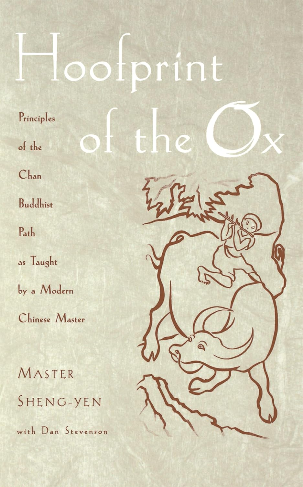

\
\

# Buddhayana

musings of a modern household practitioner

As a kid I was fascinated by the Borobudur, which led me to buddhism early in my life. I recall wanting to join a sangha in the Netherlands in my late teens, but I never dared to take the step at the time.

It wasn’t until much later that a good friend of mine put me in touch with Nalandabodhi. I joined the Dutch sangha in 2013, took my vows with Dzogchen Ponlop Rinpoche, later also with Chokyi Nyima Rinpoche (photo above) and most recently with Jake Lyne during a Western Chan Fellowship retreat. I have been practising ever since, with the usual ups and downs of course.

These pages contain my personal musings: texts that inspire me, reflections on the buddhadharma and what have you. I wrote this with the intention to inspire others to explore the buddhayana. I hope it may be of some benefit to you.

------------------------------------------------------------------------

  

\
\
\
\

##### Faith in Mind

One of may favourite dharma poems. The phrase ‘faith in mind’ contains the two meanings of ‘believing in’ and ‘realizing’ the mind. Faith in mind is the belief that we have…

鑑智僧璨 Jianzhi Sengcan (529-613), 聖嚴 Master Sheng-Yen (1931-2009)

##### Earth Touching

*“It is said that grief is actually love 一 but with nowhere to go,”* writes Ocean Vuong in the introduction of the 2022 edition of *Call Me By My True Names*. Thich Nhat…

Thich Nhat Hahn

##### Satipaṭṭhāna meditation

Bhikku Anālayo

May 3, 2026

##### Early Buddhist meditation

The term “early Buddhism” refers to approximately the first two centuries in the development of Buddhist thought and practice, from about the time when the Buddha would have…

Bhikku Anālayo

Nov 27, 2023

##### Hua-t’ou

*Hua-t’ou*, literally transalated ‘head word’ or ‘critical phrase’ is a practice used in Chinese Chan, Japanese Zen and Korean Seon. This practice is less well known…

Stuart Lachs

Feb 1, 2012

##### Becoming one with everything… and going beyond

This article explains how samadhi can be seen as a unification of mind, as taught by Master Sheng Yen. It speaks to me because it explains the different approaches between…

Matt Harvey

Jan 2, 2021

##### Orignal Yang Style Tai Chi

Daniel Kapitan

Oct 11, 2025

##### Following Gampopa

The Kagyu lineage and the teachings of Gampopa are kind of my home base. *The Four Dharmas of Gampopa* are a pith instruction in just four lines that encompass the full…

Daniel Kapitan

Sep 9, 2024

##### Selected scriptures and treatises

There are thousands of Buddhist texts, spanning many vehicles, disciplines and traditions. Below is a selection that I have come across over the years and which I think are…

##### Tantra in Indonesia

[A story to tell on the](musings/indonesia.llms.md) [:Borobudur](https://en.wikipedia.org/wiki/Borobudur), the [:Prajnaparamita of Java](https://en.wikipedia.org/wiki/Prajnaparamita_of_Java) and how…
